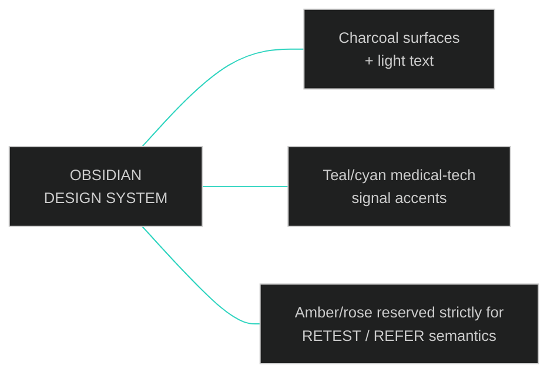
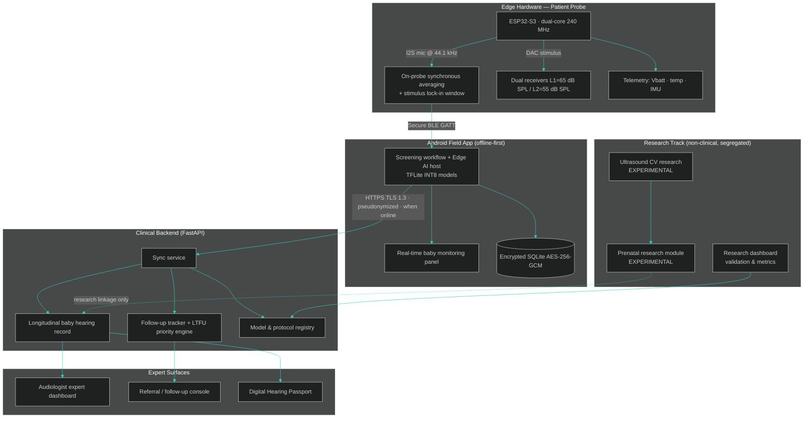
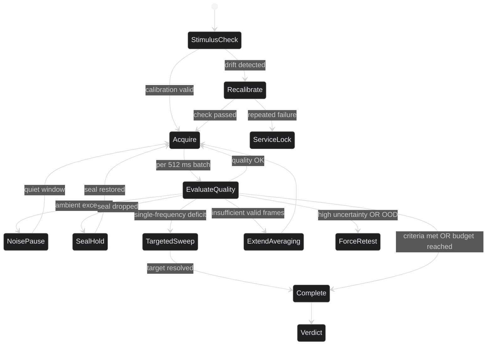
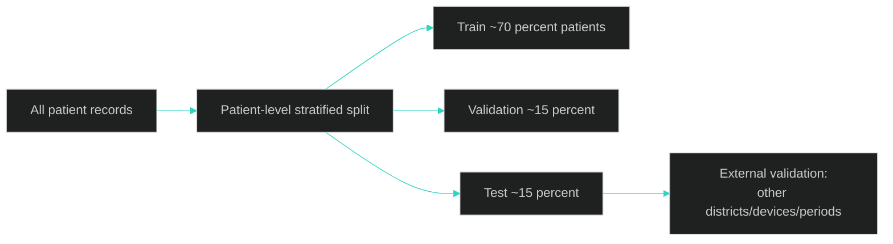

<div align="center">

# S H R U T I

### AI/ML-Assisted Newborn Hearing Screening Ecosystem
#### Low-Cost DPOAE / Two-Tone Intermodulation Screening · Software Integration Document

**Product Version:** `v4.0-OBSIDIAN` (Newborn Hearing Screening Platform)
**Companion Firmware:** SHRUTI ESP32-S3 Probe (`v1.2+`) · Android Field App (`v4.x`) · FastAPI Clinical Backend
**Deployment Context:** PHCs · CHCs · District Hospitals · NICUs · Audiology Clinics · Research Laboratories

</div>

---

## 0. Visual Design Language — "Obsidian Clinical"

The product UI and this document follow one visual identity: **premium, futuristic, medical, dark**.

| Token | Value | Usage |
| :--- | :--- | :--- |
| `--obsidian` | `#0A0E14` | Primary background (near-black charcoal) |
| `--graphite` | `#11161D` | Panel / card surface |
| `--slate-line` | `#1E2733` | Hairline borders, dividers |
| `--text-primary` | `#E6EDF3` | Primary light text |
| `--text-muted` | `#8B98A9` | Secondary text |
| `--pulse-teal` | `#2DD4BF` | Medical-tech accent: live signals, DP-grams, PASS |
| `--scan-cyan` | `#22D3EE` | Data streams, spectrogram cold-end, sync indicators |
| `--amber-flag` | `#F59E0B` | RETEST, quality warnings, calibration advisories |
| `--rose-alert` | `#F43F5E` | REFER, critical artifact events |
| `--violet-research` | `#A78BFA` | Experimental research modules only |

Typography: geometric sans (Inter / Space Grotesk) for UI; tabular numerals for all measurements. Monospace (`JetBrains Mono`) for signal values, versions and hashes. All clinical verdicts render as large, high-contrast chips: **PASS** = teal outline · **REFER** = rose outline · **RETEST** = amber outline. Waveforms and spectrograms render on near-black canvases with teal/cyan colormaps to maximize contrast of low-amplitude DPOAE peaks.

```html
<style>
  /* Obsidian Clinical — document theme (renderers that support embedded CSS) */
  .obsidian-doc { background:#0A0E14; color:#E6EDF3; }
  .obsidian-doc code { color:#2DD4BF; }
  .obsidian-doc strong { color:#FFFFFF; }
</style>
```

All mermaid diagrams in this document use the dark theme:



---

## ⛔ GLOBAL CLINICAL SAFETY STATEMENT (Applies To Every Module In This Document)

**SHRUTI never diagnoses deafness.** No model, at any layer of this system, is authorized to produce a diagnostic statement about a person's hearing status. The screening engine's *only* outputs are:

```
PASS   →  Response detected at required frequencies; routine protocol schedule
REFER  →  Required response not detected; rescreening / referral pathway per protocol
RETEST →  Technically insufficient test; repeat acquisition (not a clinical result)
```

> [!CAUTION]
> Screening is not diagnosis. A definitive determination of hearing status requires diagnostic ABR/ASSR/OAE evaluation by certified audiologists. Heart rate, SpO2, movement, crying and fetal heart rate are **never** interpreted as evidence of hearing ability or hearing loss.

The system is a **screening and decision-support system, not an autonomous diagnostic system.**

Non-overlapping responsibility layers:

| Layer | Owner | AI Role | Output |
| :--- | :--- | :--- | :--- |
| 1. Signal quality & artifact control | Software + edge AI | Full (engineering judgement, not medical) | Quality score, valid/rejected frames |
| 2. Screening verdict | **Deterministic rule engine** (`SHRUTI-CDR` protocol) | Advisory only — AI confidence is recorded, never decisive | **PASS / REFER / RETEST** |
| 3. Workflow prioritization | ML (follow-up priority only) | Full, but output is a *priority flag*, not a result | LOW / MEDIUM / HIGH follow-up priority |
| 4. Diagnostic confirmation | Certified audiologists, tertiary centres | **NONE** | Diagnostic ABR/ASSR outcome |

Information flows downward; no AI may skip layers or override the validated rule engine.

---

## 1. Mission Scope

Build the complete software ecosystem around a low-cost newborn hearing screening device using **DPOAE / two-tone intermodulation (2f1−f2)**, so that the device becomes:

- easier to operate by ASHA / ANM / frontline workers,
- more accurate and more resistant to noise and movement,
- more informative for audiologists,
- more intelligent through AI/ML that is explainable and uncertainty-aware,
- capable of real-time screening assistance and live baby monitoring,
- capable of tracking each baby's hearing journey from birth (and optionally from prenatal research) through follow-up,
- capable of reducing loss to follow-up after REFER.

### 1.1 Non-Goals (Explicitly Out Of Scope)

This project contains **no** revenue, sales, business analytics, marketing, customer analytics, financial dashboards, pricing strategy, generic hospital management, inventory management, doctor profiles, appointment management unrelated to hearing follow-up, generic healthcare chatbots, insurance, hospital billing, generic AI features unrelated to hearing screening, unrelated disease prediction, or unrelated IoT features. Any feature request that does not serve Section 1's mission is rejected at design review.

### 1.2 The Product Principle (Binding)

Every build must implement this pipeline, in this order:

```
MEASURE
  ↓
CHECK QUALITY
  ↓
REMOVE ARTIFACTS
  ↓
ANALYZE DPOAE
  ↓
ESTIMATE CONFIDENCE
  ↓
PASS / REFER / RETEST
  ↓
FOLLOW UP
  ↓
TRACK LONGITUDINALLY
```

**Never:**

```
MEASURE → AI → "YOUR BABY IS DEAF"
```

---

## 2. Ecosystem Architecture



**Runtime decomposition:**

| Process | Location | Latency budget | Failure mode |
| :--- | :--- | :--- | :--- |
| Stimulus generation + I2S capture | ESP32-S3 | Hard real-time | Watchdog reset → RETEST |
| Frame-level artifact gating | ESP32-S3 (light) + Android (full DL) | < 20 ms/frame | Fall back to statistical gating |
| DSP (FFT, averaging, SNR) | Android native | < 100 ms/epoch | Retry epoch |
| DL confidence + uncertainty | Android TFLite | < 300 ms/test | DSP-only verdict labelled "AI unavailable" |
| Rule-engine verdict | Android | < 1 ms | Never fails silently — hard error |
| Sync, records, dashboards | Backend | Async | Queue-and-sync when online |

---

## 3. Module 1 — Android Screening App

The single tool an ASHA/ANM worker needs. Designed for one-handed field use, gloves, glare, and no connectivity.

### 3.1 Guided Workflow

| Step | Behaviour |
| :--- | :--- |
| Baby registration | Minimal data set (Section 26): pseudonymous baby ID auto-generated; name/parent contact stored encrypted, synced only as pseudonyms |
| QR-based baby identification | QR wristband/card printed at registration; every subsequent scan recalls the baby's record offline — prevents duplicate IDs and misattributed results |
| Ear selection | Explicit left-ear / right-ear workflow with on-screen ear diagram and probe-in-ear confirmation before stimulus delivery |
| Automatic device connection | BLE scan → authenticated pairing (Section 26) → device health snapshot displayed before first test |
| Calibration check | Blocks screening if cavity-check expired or failed (Module 15) |
| Probe-fit check | Live seal indicator from probe-fit engine (Module 4); screening cannot start on a poor fit |
| Ambient-noise check | Measures room noise; advises quieter location if above threshold |
| One-tap screening | Single large action starts acquisition; everything else is automated |
| Real-time progress | Live frames-collected bar, per-frequency SNR meters, artifact events (Module 23 panel) |
| Result | PASS / REFER / RETEST chip + plain-language explanation + automatic record write |

### 3.2 Field-Ready Capabilities

- **Offline-first:** registration, screening, AI inference and storage work with zero internet (Module 16); automatic synchronization when connectivity returns, with a persistent sync-status indicator.
- **Languages:** Hindi + English + regional-language packs (Telugu, Tamil, Kannada, Marathi, Bengali, Odia).
- **Voice guidance:** spoken step-by-step instructions and alerts for ASHA/ANM workers ("Probe fit is poor. Reposition the probe."), literacy-independent, hands-free where possible.
- Every screen answers: *"What should I do next?"* — the app never leaves the operator guessing.

---

## 4. Module 2 — Real-Time Baby Monitoring Panel

A dedicated live panel during the test. **Where compatible sensors are available**, it displays:

| Signal | Source | Displayed As |
| :--- | :--- | :--- |
| Baby heart rate | Compatible clinical-grade sensor via BLE | BPM trend + numeric readout |
| SpO2 | Compatible pulse oximeter | % + perfusion indicator |
| Movement / activity | Probe IMU + wearable accelerometer | Motion timeline strip |
| Crying detection | On-device audio classifier (Module 5) | Event markers on timeline |
| Status state machine | Fusion of above | CALM / MOVING / CRYING chip |
| Recording-signal quality | DSP pipeline | Live quality meter |
| Sensor quality | Sensor self-diagnostics | Per-sensor OK / DEGRADED badge |

A synchronized **timeline of baby movement versus acoustic recording** lets any reviewer later see exactly which seconds of the recording coincided with motion or crying.

> [!IMPORTANT]
> Heart rate and SpO2 **do not diagnose hearing loss and are never used to infer hearing ability.** They are used exclusively to:
>
> - detect whether the baby is moving,
> - detect crying,
> - detect periods where the hearing recording may be unreliable,
> - automatically pause acquisition / recommend retesting when necessary,
> - synchronize physiological events with the DPOAE recording.

If no compatible sensor is connected, the panel hides physiological tiles gracefully and relies on IMU + audio classifiers alone — monitoring is an enhancement, never a dependency.

---

## 5. Module 3 — AI Crying & Movement Detection

A dedicated neural classifier parses the raw stream in sliding windows (**256 ms, 50% overlap**) over these classes:

| Class | Acoustic Signature | Detection Features |
| :--- | :--- | :--- |
| Crying | 300–600 Hz fundamental, harmonic stacks, F0 modulation 3–8 Hz | Harmonicity score, pitch-trajectory variance |
| Sudden movement | <150 Hz rumble transients, broadband thumps | Low-frequency energy ratio, onset sharpness |
| Vocalization (baby, non-cry) | Short harmonic bursts, lower energy than cry | Pitch-track continuity |
| External speech | F0 85–255 Hz, formant structure | Formant tracker + speech/non-speech head |
| Door slam / impact | Impulsive >20 dB step with <80 ms decay | Peak-to-RMS ratio, crest factor |
| Fan noise | Stationary narrowband LF hum + broadband whoosh | Spectral stationarity, template match |
| AC noise | Compressor rumble + tonal lines | Tonal-bin persistence |
| Traffic / background | Broadband slow-modulating bed | Long-window level statistics |
| Electrical interference | 50/60 Hz + harmonics, stable phase relations | Comb-template correlation |
| Microphone clipping | Flat-topped waveforms, odd-harmonic growth | Fraction of samples at rails, THD proxy |
| CLEAN | None of the above dominant | — |

**Contamination policy:** any window whose critical-class probability exceeds **0.50** (or `CLEAN < 0.35`) is marked REJECTED and excluded from the synchronous average *before* DSP — protecting SNR integrity at the source. Borderline windows (0.35–0.50) are down-weighted rather than discarded. Contaminated portions are visually hatched on the recording timeline and excluded from every downstream computation.

Structured output consumed by the UI timeline, retest engine, reports and audit trail:

```json
{
  "artifact_analysis": {
    "window_size_ms": 256, "overlap": 0.5,
    "total_windows": 172, "rejected_windows": 14, "downweighted_windows": 6,
    "artifact_rate_percent": 8.1,
    "events": [
      { "artifact_type": "crying", "confidence": 0.94,
        "affected_interval_s": [12.25, 15.75], "frames_rejected": 13,
        "operator_hint": "comfort_pause_recommended" },
      { "artifact_type": "electrical_interference", "confidence": 0.71,
        "affected_interval_s": [41.0, 43.25], "frames_rejected": 1,
        "operator_hint": "check_cable_routing" }
    ]
  }
}
```

---

## 6. Module 4 — Smart Probe-Fit Detection

An acoustic-quality engine running continuously before and during acquisition. It detects:

| Fault | Physics Of Detection |
| :--- | :--- |
| Poor ear-tip seal | Weak seal-check reflection; broadband HF hiss ingress |
| Probe leakage | Stimulus level droop + HF slope anomaly |
| Incorrect positioning | Canal-resonance signature deviates from reference cavity geometry |
| Microphone saturation | Sample-rail fraction, THD proxy growth |
| Excessive noise | Ambient band power above protocol threshold |
| Unstable stimulus | L1/L2 bin-level jitter > ±2 dB frame-to-frame |
| Receiver imbalance | Left/right receiver output mismatch at stimulus bins |

**Hard gate:** if measured quality is poor, the engine **does not generate PASS/REFER**. The app shows exactly one corrective instruction:

```
REPOSITION PROBE      ← seal / positioning faults
REDUCE NOISE          ← ambient / interference faults
WAIT FOR BABY TO CALM ← crying / movement faults
RETEST REQUIRED       ← unresolvable within session budget
```

Verdict suppression is enforced in software: the rule engine refuses to evaluate any test whose probe-fit quality gate did not pass, and the refusal is journaled to the audit trail.

---

## 7. Module 5 — Advanced DPOAE Signal Processing

Classical DSP remains the **authoritative basis for verdicts**. Stimulus pair \(f_2/f_1 \approx 1.22\), L1 = 65 dB SPL, L2 = 55 dB SPL; distortion product at \(f_{dp} = 2f_1 - f_2\).

| Capability | Definition |
| :--- | :--- |
| FFT | Windowed spectral estimation per epoch (Hann window, zero-padded) |
| Spectrogram | Rolling time–frequency view for operators and experts |
| 2f1−f2 extraction | Narrowband peak search around theoretical \(f_{dp}\): \(P_{dp} = \max_{f \in [f_{dp}\pm\Delta f]} 20\log_{10}\lvert X(f)\rvert\) |
| DP amplitude | \(P_{dp}\) in dB SPL, per frequency |
| Noise floor | Mean of adjacent non-stimulus bins: \(N_{floor} = \frac{1}{M}\sum_i 20\log_{10}\lvert X(f_i)\rvert\) |
| SNR | \(\text{SNR} = P_{dp} - N_{floor}\) per frequency |
| Frequency-specific analysis | Sweep across 2 / 3 / 4 / 5 kHz |
| Synchronous averaging | Stimulus-locked coherent averaging across accepted frames |
| Artifact rejection | Pre-DSP window exclusion (Module 5 classifier + statistical gate fallback) |
| Time-frequency analysis | Per-frame DP tracking; contamination mapping |
| Left/right ear comparison | Side-by-side DP-grams and asymmetry flags |
| Signal stability analysis | Temporal consistency: \(C_{temp} = 1 - \sigma(P_{dp,\text{frames}})/(\mu(P_{dp,\text{frames}})+\epsilon)\) |
| Frequency-wise confidence | Per-frequency reliability estimate combining SNR stability + AI confidence |

Protocol default (versioned, `SHRUTI-CDR-v1.0`, engineered against IEC 60645-6): frequency passes if **SNR ≥ 6 dB** with adequate stability; ear passes if **≥ 3 of 4 frequencies** pass. Thresholds are protocol configuration items — never tuned silently.

---

## 8. Module 6 — AI/ML DPOAE Analysis

A parallel advisory path that helps determine whether a measured response is a **reliable cochlear emission or noise/artifact**. It never bypasses the rule engine; its outputs are confidence, stability and quality signals logged beside the verdict.

### 8.1 Model Portfolio

| # | Model | Input | Purpose | Runtime target |
| :--- | :--- | :--- | :--- | :--- |
| M1 | **CNN for raw waveform (1D CNN)** | Waveform [1 × 44100] | Temporal morphology: transients, bursts, clipping flat-spots, stimulus leakage — artifacts invisible after FFT averaging | Android CPU INT8, ~15 ms |
| M2 | **CNN for spectrogram (2D CNN)** | Log-mel STFT [128 × 87] | Time-frequency texture: DP-tone persistence vs harmonic cry stacks vs broadband leak hiss | ~25 ms |
| M3 | **CNN-LSTM temporal stability** | Sequence of per-frame embeddings [T × 192] | Is the DP component phase-locked and stationary? Instability ⇒ artifact or poor seal | ~40 ms |
| M4 | **Transformer signal encoder** *(advanced research option)* | Patch-embedded spectrogram + positional encoding | Global attention over time-frequency patches; attention maps aid XAI; cloud/GPU research track only | Cloud GPU |
| M5 | **Multi-frequency feature fusion** | Concatenated embeddings across tested frequencies | Joint ear-level inference with learnable attention weighting | negligible |
| M6 | **Hybrid DSP + ML ensemble** | DSP feature vector ⊕ M1–M5 embeddings → calibrated gradient-boosted trees | Production meta-model; outperforms either DSP-only or DL-alone in ablations | ~5 ms |

### 8.2 Reference Implementations (PyTorch)

```python
import torch
import torch.nn as nn
import torch.nn.functional as F

class DPOAE1DCNN(nn.Module):
    """M1 — temporal-morphology encoder over the raw waveform."""
    def __init__(self):
        super().__init__()
        self.conv1 = nn.Conv1d(1, 16, kernel_size=64, stride=4, padding=30)
        self.bn1 = nn.BatchNorm1d(16)
        self.conv2 = nn.Conv1d(16, 32, kernel_size=32, stride=2, padding=15)
        self.bn2 = nn.BatchNorm1d(32)
        self.conv3 = nn.Conv1d(32, 64, kernel_size=16, stride=2, padding=7)
        self.bn3 = nn.BatchNorm1d(64)
        self.conv4 = nn.Conv1d(64, 128, kernel_size=8, stride=2, padding=3)
        self.bn4 = nn.BatchNorm1d(128)
        self.pool = nn.AdaptiveAvgPool1d(1)
        self.fc = nn.Linear(128, 64)

    def forward(self, x):
        x = F.relu(self.bn1(self.conv1(x)))
        x = F.relu(self.bn2(self.conv2(x)))
        x = F.relu(self.bn3(self.conv3(x)))
        x = F.relu(self.bn4(self.conv4(x)))
        return F.relu(self.fc(self.pool(x).squeeze(-1)))   # embedding [B, 64]


class SpectrogramCNN2D(nn.Module):
    """M2 — time-frequency texture encoder over log-mel spectrograms."""
    def __init__(self):
        super().__init__()
        self.conv1 = nn.Conv2d(1, 16, 3, padding=1)
        self.bn1 = nn.BatchNorm2d(16)
        self.conv2 = nn.Conv2d(16, 32, 3, stride=2, padding=1)
        self.bn2 = nn.BatchNorm2d(32)
        self.conv3 = nn.Conv2d(32, 64, 3, stride=2, padding=1)
        self.bn3 = nn.BatchNorm2d(64)
        self.pool = nn.AdaptiveAvgPool2d((4, 4))
        self.fc = nn.Linear(64 * 4 * 4, 128)

    def forward(self, x):
        x = F.relu(self.bn1(self.conv1(x)))
        x = F.relu(self.bn2(self.conv2(x)))
        x = F.relu(self.bn3(self.conv3(x)))
        return F.relu(self.fc(self.pool(x).flatten(1)))    # embedding [B, 128]


class TemporalStabilityCNNLSTM(nn.Module):
    """M3 — sequence model scoring whether the DP component stays locked."""
    def __init__(self, input_dim=192, hidden_dim=64, num_layers=2):
        super().__init__()
        self.lstm = nn.LSTM(input_dim, hidden_dim, num_layers,
                            batch_first=True, bidirectional=True)
        self.fc = nn.Linear(hidden_dim * 2, 32)

    def forward(self, x):
        out, _ = self.lstm(x)
        return F.relu(self.fc(out[:, -1, :]))


class SpectrogramTransformerEncoder(nn.Module):
    """M4 — ADVANCED RESEARCH OPTION. Cloud/GPU research track only;
    attention maps double as interpretability artefacts."""
    def __init__(self, patch=8, dim=128, depth=4, heads=4):
        super().__init__()
        self.patch_embed = nn.Conv2d(1, dim, kernel_size=patch, stride=patch)
        self.pos_emb = nn.Parameter(torch.randn(1, 256, dim) * 0.02)
        layer = nn.TransformerEncoderLayer(d_model=dim, nhead=heads,
                                           dim_feedforward=256,
                                           batch_first=True, dropout=0.1)
        self.encoder = nn.TransformerEncoder(layer, num_layers=depth)
        self.norm = nn.LayerNorm(dim)

    def forward(self, spec):
        x = self.patch_embed(spec).flatten(2).transpose(1, 2)
        x = x + self.pos_emb[:, :x.size(1), :]
        return self.norm(self.encoder(x)).mean(dim=1)


class MultiFrequencyFusion(nn.Module):
    """M5 — cross-frequency fusion with learnable attention (XAI-visible)."""
    def __init__(self, emb_dim=128):
        super().__init__()
        self.attn = nn.Sequential(nn.Linear(emb_dim, 32), nn.Tanh(),
                                  nn.Linear(32, 1))
        self.out = nn.Linear(emb_dim, 64)

    def forward(self, freq_embs):
        w = torch.softmax(self.attn(freq_embs), dim=1)
        fused = (w * freq_embs).sum(dim=1)
        return F.relu(self.out(fused)), w
```

**M6 production path:** calibrated gradient-boosted trees over `[Pdp(f), Nfloor(f), SNR(f) ∀f, σ_frames, seal, ambient_dB, valid_frame_count] ⊕ [M1 ⊕ M2 ⊕ M3 embeddings] ⊕ [device context]`, producing a **confidence score per frequency**, isotonic-calibrated, stored with every result.

### 8.3 Uncertainty Estimation

Monte Carlo Dropout (T stochastic passes) approximates predictive variance; deep ensembles (N=5 seeds) capture model-form disagreement; temperature scaling calibrates stated probabilities (deployment gate: Expected Calibration Error ≤ 0.05).

```python
def monte_carlo_dropout_predict(model, x, num_samples=50):
    model.train()                       # keep dropout stochastic at inference
    preds = torch.stack([F.softmax(model(x), dim=-1) for _ in range(num_samples)])
    mean_prediction = preds.mean(dim=0)
    variance_prediction = preds.var(dim=0)
    entropy = -(mean_prediction * torch.log(mean_prediction + 1e-8)).sum(-1)
    return mean_prediction, variance_prediction, entropy
```

| Band | Post-calibration entropy | System behaviour |
| :--- | :--- | :--- |
| HIGH confidence | ≤ 0.15 | Confidence logged alongside verdict |
| MODERATE | 0.15 – 0.40 | Recommend extended averaging / targeted retest before export |
| LOW | ≥ 0.40 | **Automatically recommends RETEST** — no bare PASS/REFER surfaced |

### 8.4 Out-of-Distribution Detection

Three-signal vote (2-of-3) short-circuits inference on inputs unlike training data: **Mahalanobis distance** in penultimate-layer space, **autoencoder reconstruction error**, and **kNN embedding distance** (k=20). Thresholds sit at the 99th percentile of validation in-distribution data. On trigger, the operator sees `UNSEEN SIGNAL CONDITION — RETEST / EXPERT REVIEW`; no neural output reaches a decision path.

---

## 9. Module 7 — Explainable AI

The AI is never a black box. Every test exposes, on demand, to audiologists and researchers:

| Evidence Shown | Source |
| :--- | :--- |
| Detected DPOAE peak | DSP peak search (verified against neural peak proposal within ±½ bin) |
| Expected 2f1−f2 location | Protocol stimulus math |
| Noise floor / SNR | Classical DSP |
| Valid frames / rejected frames | Artifact pipeline, with reasons per interval |
| Probe quality | Seal reflection match, HF hiss index |
| Stimulus stability | L1/L2 jitter trace |
| Signal confidence | DSP stability + calibrated ensemble score |
| AI confidence + uncertainty band | M6 + MC-dropout entropy |
| Reason for RETEST | Retest engine cause table (Module 8) |

Technique-to-model mapping: SHAP (TreeSHAP) force plots for the tabular ensemble; occlusion heat-strips along time for M1; saliency/Grad-CAM overlays on spectrograms for M2; gradient×input curves for M3; attention rollout thumbnails for M4. The rule engine itself emits a deterministic threshold trace — transparent by construction.

```
Signal confidence: LOW — RETEST RECOMMENDED
Reasons:
 - High movement artifact (18% of frames rejected)
 - Excessive environmental noise (52 dBA ambient)
 - Weak signal stability (DP amplitude CV = 37%)
 - Probe leakage suspected (HF hiss + reflection match 71%)
Suggestions:
 - Reposition probe / try next ear-tip size
 - Move to screening room or wait for quieter period
 - Comfort/swaddle infant before resuming
```

The full explanation payload persists inside the screening record, so any historical decision remains reproducible and auditable. Experts can always inspect the actual raw waveform behind every number.

---

## 10. Module 8 — Smart Retest Engine

Instead of repeating the entire test, the engine identifies **why** the measurement failed and applies the minimal corrective action.

| Detected Cause | Action | Operator Sees |
| :--- | :--- | :--- |
| Poor seal | Hold acquisition, preserve valid partial averages | "Reposition probe" |
| Baby crying | Auto-pause buffering; resume on clean window | "Waiting for baby to calm" |
| High environmental noise | Pause; hold state | "Reduce noise / wait" |
| Insufficient clean frames | Continue acquisition up to time budget; extend averaging | Progress bar continues |
| One unreliable frequency | Targeted retest sweep of **only** that frequency, where protocol permits | Badge: "Retesting 4 kHz only" (~70% time saved) |
| Stimulus instability | Route to device check (cavity self-test) | "Running stimulus check…" |
| High uncertainty / OOD despite adequate frames | Force RETEST recommendation; abort decision path | One-tap RETEST |
| Repeated failure | Escalate: mark for expert review with full evidence bundle | Referral note to audiologist |

State machine (hysteresis: a trigger must persist 3 consecutive evaluations; every transition journaled):



Design objective: minimize expected test duration subject to reliability constraints — \(\min \mathbb{E}[T_{test}]\) s.t. \(P(\text{valid measurement}) \ge 0.95\) and \(N_{valid\_frames} \ge N_{min}\).

---

## 11. Module 9 — Clinical Screening Engine

Deterministic, versioned, auditable. Output vocabulary is **exactly**: `PASS` · `REFER` · `RETEST`. Nothing else. The word "deaf" appears nowhere in the software as a possible outcome.

Inputs gated in strict order:

1. **Quality gate** — DQS ≥ 50 and probe-fit pass required; otherwise RETEST without evaluation.
2. **Frequency-specific rules** — per-frequency SNR ≥ 6 dB and stability requirement; ≥3 of 4 frequencies per ear (protocol `SHRUTI-CDR-v1.0`).
3. **SNR-based analysis** — classical measurements only; AI confidence recorded but never decisive.
4. **Provenance stamp** — every verdict stores: protocol version, device calibration status, software version, AI model version, test timestamp, raw-signal hash.

> [!CAUTION]
> The rule engine can only be changed through formal change control: versioned protocol, retrospective replay on frozen benchmarks, expert sign-off. No AI model may override it at runtime.

---

## 12. Module 10 — Hearing Profile

A visual, per-baby profile rendering both ears' current and historical acoustics:

- Right-ear DP-gram and left-ear DP-gram (DP amplitude vs frequency),
- frequency-wise response table: SNR, DP amplitude, noise floor,
- test quality (DQS) per session,
- previous results alongside current result,
- full screening history with trend arrows per frequency.

```
BABY INF-8812 · HEARING PROFILE                    Protocol SHRUTI-CDR-v1.0
──────────────────────────────────────────────────────────────
            2 kHz     3 kHz     4 kHz     5 kHz
RIGHT EAR   SNR 28.1  SNR 26.4  SNR  5.2  SNR  2.1   → REFER
LEFT  EAR   SNR 28.0  SNR 32.8  SNR 30.0  SNR 29.0   → PASS
History: D1 PASS/PASS · D22 PASS/REFER · today PASS/REFER (right 4–5 kHz)
──────────────────────────────────────────────────────────────
```

Designed so an audiologist grasps the baby's status in five seconds and a researcher can drill into every number.

---

## 13. Module 11 — Longitudinal Baby Hearing Record

One immutable, append-only timeline per baby:

```
Birth screening → Repeat screening → REFER → Rescreen →
Diagnostic referral → Diagnostic outcome (entered ONLY by authorized clinical personnel)
```

Each node records timestamp, facility, device, protocol/model/calibration versions, verdict and quality metrics. The diagnostic-outcome node accepts input solely from accounts holding the audiologist role; screening-tier users see it read-only once entered. The timeline view is shared by frontline workers (simple stage chips), audiologists (full detail) and the Digital Hearing Passport (Module 22).

Pattern surveillance runs over timelines: repeated REFERs escalate priority; implausible swings (PASS→REFER within hours) attach a technical-contribution advisory instead of conclusions.

---

## 14. Module 12 — Loss-To-Follow-Up Solution

After a REFER, the system attacks the largest leak in newborn hearing programmes — families who never return.

Automatic machinery on every REFER:

| Capability | Behaviour |
| :--- | :--- |
| Follow-up task creation | Task auto-generated the moment REFER is confirmed; assigned to the originating worker + supervisor visibility |
| Reminder generation | Multilingual reminders anchored to routine child-health visit dates where appropriate (piggyback travel) |
| Rescreen attendance tracking | Scanning the baby's QR at any facility closes the loop automatically |
| Referral completion tracking | Diagnostic-referral status maintained end-to-end |
| Overdue detection | SLA clock per protocol stage; overdue items surface in the follow-up console |
| Repeated-REFER prioritization | REFER→REFER babies automatically rise in the queue |
| Child-health linkage | Follow-up can be attached to existing immunization/well-baby visits where programmes allow |
| Referral history | Every contact attempt, reminder and outcome logged into the baby's record |

Funnel view (screening-programme vital sign, strictly hearing-focused):

```
[Screened: 1200] → [REFER: 80] → [Rescreened: 60] → [Diagnostic referral: 24]
                 → [Diagnostic assessment: 12]
Stage-wise dropout + delay shown at every arrow.
```

---

## 15. Module 13 — Follow-Up ML

Machine learning used for **one purpose only**: predicting which families are more likely to miss follow-up, so support can be concentrated there. It never diagnoses hearing loss and never touches verdicts.

| Feature | Note |
| :--- | :--- |
| Previous missed follow-up | Strongest single predictor; monotonicity constraint enforced |
| Time since REFER | SLA decay feature |
| Reminder status | Delivered / engaged / unanswered |
| Previous contact attempts | Count + recency |
| Referral status | Open / scheduled / completed |
| Appointment availability at linked centre | Access-side friction |

Calibrated gradient-boosted model (Platt scaling). Output bands:

| Band | P(LTFU) | Outreach posture |
| :--- | :--- | :--- |
| **LOW** | < 0.30 | Standard SMS reminder |
| **MEDIUM** | 0.30 – 0.70 | Voice call + regional-language message |
| **HIGH** | > 0.70 | Direct ASHA/ANM home-visit outreach; supervisor visibility |

> [!IMPORTANT]
> Risk scores exist **only to concentrate supportive resources** on families who need them most. They are never used to deny, ration or deprioritize care, never shown to families as judgements, and audited monthly for disparate flagging across subgroups.

---

## 16. Module 14 — Audiologist Expert Dashboard

A separate expert workspace (distinct role, distinct UI density) exposing everything the field app deliberately simplifies:

- Raw waveform (zoomable, segment-selectable),
- FFT spectrum with f1/f2/fdp annotations,
- Spectrogram with artifact hatching overlay,
- DP-gram and frequency response tables,
- SNR and noise floor per frequency, per session, per ear,
- Probe-fit quality trace,
- Artifact timeline synchronized with baby-monitoring events,
- AI confidence, uncertainty band, OOD flags,
- Previous tests (cross-session comparison, embedding-drift advisory),
- Device calibration ledger and expiry,
- Model version + protocol version stamped on every pane.

From here, experts annotate cases, confirm or correct retest causes, enter diagnostic outcomes (role-gated), and export de-identified research bundles.

---

## 17. Module 15 — Device Health Software

Turns every screening into a free device diagnostic.

| Check | Method | Failure Behaviour |
| :--- | :--- | :--- |
| Microphone self-test | Sensitivity estimate via seal-check tone vs factory baseline | Advisory → restrictive lock beyond tolerance |
| Receiver self-test | Output level at stimulus bins, channel balance | Receiver-imbalance flag blocks screening |
| Audio codec check | Loopback verification at boot | Boot failure reported, device quarantined |
| Battery monitoring | Charge curves, internal-resistance proxy, cycle count | Low-health warning before field failure |
| BLE status | Pairing success rate, retry statistics | Connectivity advisories |
| Storage status | On-device encrypted store headroom | Pre-sync pressure warnings |
| Calibration expiry | Ledger timestamp vs protocol validity window | Hard block on expiry |
| Microphone drift detection | Cavity-response correlation vs baseline: \(R\) + max per-bin deviation | R < 0.95 or max-dev > 3 dB ⇒ LOCKED until supervised recalibration |
| Receiver imbalance detection | Inter-stimulus-bin channel comparison | Service flag |
| Automatic warnings | EWMA + isolation-forest anomaly scoring over telemetry channels | Advisory vs restrictive tiers, both journaled |

> [!CAUTION]
> Software may detect, predict and recommend calibration actions, but can **never silently modify** medically relevant calibration values. Physical adjustments happen only through the supervised cavity procedure, signed off by an authorized operator, written immutably to the calibration ledger.

---

## 18. Module 16 — Offline-First Design

Built for PHC/rural environments where internet is absent, slow or metered.

| Requirement | Implementation |
| :--- | :--- |
| Offline baby registration | Local encrypted SQLite (AES-256-GCM, keys in Android Keystore) |
| Offline screening | Full workflow + verdict on-device; cloud adds intelligence, never gates care |
| Offline AI inference | TFLite INT8 artifact classifier, quality scorer, distilled uncertainty student run locally |
| Local encrypted storage | At-rest encryption + tamper-evident hash-chained audit log |
| Automatic synchronization | Append-only sync envelopes (pseudonymized), idempotent, conflict-safe; resumes partial uploads |
| Sync-status indicator | Persistent chip: SYNCED / QUEUED n / OFFLINE — never hidden |
| Graceful degradation order | ESP32 gating → Android edge AI → optional cloud enrichment; any tier failing degrades visibly ("AI unavailable"), never silently |

Raw audio never leaves the device unless explicitly opted in for research.

---

## 19. Module 17 — Parent Module

After screening, parents receive a simple, printed + SMS-delivered summary in their language. Approved templates only — zero improvisation, zero diagnostic language.

**For PASS:**
> "Screening response detected. Continue routine hearing and child-health monitoring."

**For REFER:**
> "Another hearing check is recommended. REFER does not mean a diagnosis of hearing loss."

Includes: regional-language rendering (Hindi, Telugu, Tamil, Kannada, Marathi, Bengali, Odia, English), icon-supported layouts for low-literacy contexts, rescreening reminder with date/place, referral information (where to go, what to carry), and the digital screening summary tied to the baby's Hearing Passport QR. Example Hindi REFER text: "इसका मतलब यह नहीं है कि आपके बच्चे को सुनने में दिक्कत है। बच्चे की सुनने की जांच दोबारा करना ज़रूरी है।"

---

## 20. Module 18 — Prenatal / Pre-Birth Research Module

> [!WARNING]
> **EXPERIMENTAL RESEARCH MODULE.** This module does **not** diagnose fetal deafness and makes **no claim** of detecting fetal hearing status — including any claim of diagnosing deafness "from the mother's stomach." Its sole purpose is to explore whether prenatal signals can identify pregnancies that warrant **enhanced newborn hearing surveillance** at birth. Any clinical use requires prospective trials and separate regulatory approval. All prenatal data lives in segregated, separately consented research storage and is never fused into clinical records without explicit re-consent.

### 20.1 Potential Sensing Inputs

| Modality | Signals / Features |
| :--- | :--- |
| Maternal abdominal contact microphone | Abdominal sound-field decomposition: maternal heartbeat, bowel sounds, maternal voice conduction, fetal acoustic activity, external noise |
| Piezoelectric abdominal sensor | Movement-correlated burst envelopes; per-epoch signal-quality gating |
| Experimental vibroacoustic stimulus-response research | Stimulus-present vs control movement indices; habituation patterns (research protocols only) |
| Fetal heart-rate input | From appropriate clinical monitoring equipment, where clinically available |
| Ultrasound video/image analysis | Via the Module 20 research pipeline |
| Gestational age | From clinical record, gestational-age-aware analysis throughout |
| Relevant clinical/family history | Family hearing-loss history, ototoxic exposures, maternal infections — research variables |

### 20.2 Multimodal Research Model

Calibrated multimodal ensemble with SHAP reason sets and persistent banner: *"EXPERIMENTAL RESEARCH OUTPUT — NOT A DIAGNOSIS — NOT FOR CLINICAL DECISION MAKING."*

Output — **enhanced-surveillance recommendation only**:

```
LOW      → standard newborn screening schedule
MODERATE → enhanced surveillance recommendation
HIGH     → enhanced surveillance recommendation
           + priority newborn DPOAE screening at birth
```

---

## 21. Module 19 — Prenatal Real-Time Monitoring Dashboard (Research)

Where clinically available and consented, the research dashboard shows: fetal heart rate (from appropriate clinical equipment), fetal movement indices, signal quality per channel, stimulus timing markers, observed movement response windows, and a unified timeline visualization.

> [!IMPORTANT]
> Fetal heart rate alone must **never** be interpreted as evidence of hearing ability. It is displayed as a physiologic context signal for research sessions only.

---

## 22. Module 20 — Prenatal Ultrasound AI Research

Experimental computer-vision research to extract quantitative movement indicators — assistive to trained clinicians, never replacing sonographer interpretation.

| Task | Model Family | Output |
| :--- | :--- | :--- |
| Region-of-interest detection | Object detection (frame level) | ROI proposals with confidence; clinician confirms |
| Segmentation | U-Net-family encoder-decoder | Anatomical boundary proposals |
| Fetal movement tracking | Detection + temporal video models (3D-CNN / ConvLSTM) | Movement trajectories and counts feeding Module 18 |
| Video-based movement analysis | Temporal pattern models | Gestational-age-aware temporal movement patterns |

Low-confidence detections are suppressed rather than shown; every proposal logs whether the clinician accepted, adjusted or rejected it (future training signal). Research question driving this module: **do prenatal movement/stimulus-response patterns correlate with later newborn DPOAE screening outcomes?** — answered only through linked, consented longitudinal research data.

Reference segmentation backbone:

```python
class UltrasoundSegmentationUNet(nn.Module):
    """Research-only fetal structure segmentation backbone."""
    def __init__(self, in_channels=1, out_channels=1):
        super().__init__()
        self.enc1 = self.conv_block(in_channels, 64)
        self.enc2 = self.conv_block(64, 128)
        self.enc3 = self.conv_block(128, 256)
        self.pool = nn.MaxPool2d(2, 2)
        self.bottleneck = self.conv_block(256, 512)
        self.up3 = nn.ConvTranspose2d(512, 256, 2, 2)
        self.dec3 = self.conv_block(512, 256)
        self.up2 = nn.ConvTranspose2d(256, 128, 2, 2)
        self.dec2 = self.conv_block(256, 128)
        self.up1 = nn.ConvTranspose2d(128, 64, 2, 2)
        self.dec1 = self.conv_block(128, 64)
        self.final = nn.Conv2d(64, out_channels, 1)

    def conv_block(self, i, o):
        return nn.Sequential(
            nn.Conv2d(i, o, 3, padding=1), nn.BatchNorm2d(o), nn.ReLU(inplace=True),
            nn.Conv2d(o, o, 3, padding=1), nn.BatchNorm2d(o), nn.ReLU(inplace=True))

    def forward(self, x):
        e1 = self.enc1(x); e2 = self.enc2(self.pool(e1)); e3 = self.enc3(self.pool(e2))
        b = self.bottleneck(self.pool(e3))
        d3 = self.dec3(torch.cat([self.up3(b), e3], dim=1))
        d2 = self.dec2(torch.cat([self.up2(d3), e2], dim=1))
        return self.final(self.dec1(torch.cat([self.up1(d2), e1], dim=1)))
```

---

## 23. Module 21 — Prenatal → Newborn Continuity

One of the project's strongest features: a single continuous journey, carried under one pseudonymous identity with strict research/clinical segregation until re-consented linkage:

```
PREGNANCY
  ↓
Prenatal research profile (EXPERIMENTAL · enhanced-surveillance flag only)
  ↓
BIRTH
  ↓
Newborn DPOAE screening (priority slot if prenatal flag = HIGH)
  ↓
PASS / REFER / RETEST
  ↓
Rescreening
  ↓
Diagnostic follow-up
```

Implementation: the prenatal research record stores a research-ID; at birth, with explicit consent, the enhanced-surveillance flag (never the raw research signals) attaches to the newborn record, scheduling priority birth screening. The combined timeline then renders in the baby's Longitudinal Record and Hearing Passport — giving researchers, for the first time, a conserved prenatal-to-newborn hearing-risk dataset.

---

## 24. Module 22 — Digital Hearing Passport

A portable digital summary for every screened baby:

| Field | Content |
| :--- | :--- |
| Baby ID + QR code | Scan-to-recall at any facility; works offline via local cache |
| Prenatal research flag | Present only if applicable; labelled EXPERIMENTAL; carries surveillance level, never diagnoses |
| Birth screening | Date, facility, verdict |
| Right-ear / left-ear results | Latest verdicts + per-frequency SNR summary |
| Previous screenings | Compact history |
| Referral history | Issued/completed referrals |
| Follow-up status | Next due step, overdue indicator |
| Diagnostic status | Visible only after authorized entry |

Rendered printable (low-tech fallback) and digital (QR-linked page). The passport is the family-facing face of the entire longitudinal pipeline.

---

## 25. Module 23 — Real-Time Analytics (Live Test Panel)

During the test, the app renders six synchronized zones:

```
┌──────────────────────────────────────────────────────────────────┐
│ BABY         HR 138 bpm ▁▃▅▃▂   SpO2 98%   STATUS: CALM          │
│ ENVIRONMENT  Noise 34 dBA   Events: door-slam @ 00:41 (rejected) │
│ DEVICE       Batt 82%  BLE −58 dBm  Calib VALID  Rx BALANCED     │
│ HEARING      fdp 3.0 kHz  DP −8.4 dB  Floor −41.2  SNR 32.8 dB   │
│              Frames 158 valid / 14 rejected  Probe-fit GOOD      │
│ AI           Artifact conf 0.06  Signal conf 0.91  Uncert 0.08   │
│ RESULT                                          ┌────────────┐   │
│                                                 │   PASS     │   │
│                                                 └────────────┘   │
└──────────────────────────────────────────────────────────────────┘
```

Every zone updates live; the RESULT zone stays greyed until the quality gate clears — the interface physically cannot show a verdict for an invalid measurement.

---

## 26. Module 24 — Advanced Research Dashboard

For researchers and ML engineers validating and refining the algorithms:

| Category | Contents |
| :--- | :--- |
| Core discrimination | Sensitivity, specificity, PPV/NPV, F1 — bootstrap confidence intervals on every metric |
| Curves | ROC curve, precision-recall curve, confusion matrices |
| Calibration | Reliability curves + ECE per model |
| Distributions | Signal distributions, artifact distributions, DPOAE-amplitude distributions, noise-floor distributions |
| Validation breadth | Cross-device validation, cross-environment validation, subgroup slices (gestational age, NICU vs well-baby, sex, noise quartile, device generation) |
| Benchmarking | **AI versus traditional DSP** side-by-side on identical frozen datasets: DSP-only vs classical-ML vs deep-learning vs hybrid ensemble — pinned to dataset snapshots and registry versions for exact reproducibility |
| Uncertainty analytics | Risk-coverage curves, uncertainty-vs-correctness plots |

---

## 27. Module 25 — Safety & Clinical Validation

Binding requirements for every model release:



| Control | Rule |
| :--- | :--- |
| Patient-level train/test splitting | All recordings from one baby (both ears, all sessions) stay on one side of the split — grouped k-fold by patient ID for model selection |
| **No data leakage between the same baby's recordings** | Leakage audit rejects any training job violating grouping; same-baby recordings are highly correlated, and leakage inflates test scores while hiding real-world failure |
| External validation | Held-out cohort from different district/device-generation/time-period before any release |
| Subgroup analysis | Performance reported per predefined subgroup; disparities flagged for disposition |
| Confidence intervals | Bootstrap CIs on headline metrics; n and event count reported alongside |
| Model versioning | Immutable registry entries; every verdict stores its model version |
| Protocol versioning | Rule thresholds are versioned configuration; changes require replay + sign-off |
| Human expert review | Governance board sign-off; expert review mandatory for repeated-failure escalations and OOD clusters |
| Clinical validation before deployment | Prospective clinical evaluation precedes any real-world screening use |

Release gate (abbreviated): leakage audit passed · external validation ≥ pre-registered floor · calibration ECE ≤ 0.05 · subgroup disparities documented · edge/cloud agreement ≥ 99% · board sign-off recorded. Models are **never silently updated**.

---

## 28. Module 26 — Privacy & Security

| Domain | Controls |
| :--- | :--- |
| Encryption | AES-256-GCM at rest (device DB, ESP32 flash); TLS 1.3 + certificate pinning in transit |
| Role-based access | Least privilege server-side: ASHA/ANM operator · supervisor · audiologist (diagnostic entry) · district admin · researcher (de-identified only) · sysadmin |
| Secure BLE | LE Secure Connections, passkey/OOB pairing, bonding, MITM protection, device attestation keys |
| Pseudonymous baby ID | HMAC-SHA256 pseudonyms before sync; re-identification map held separately under stricter access |
| Audit logs | Append-only, hash-chained trail binding operator, device, software/model/calibration/protocol versions, verdict, overrides and raw-signal hash for every decision |
| Minimal data collection | Only fields serving screening and follow-up; nothing speculative |
| Research/clinical separation | Identifiable clinical data and research datasets stored, consented and access-controlled separately; linkage only via explicit re-consent (Module 21) |
| Threat modelling | STRIDE-reviewed each major release; annual third-party penetration testing; BLE-parser and sync-API fuzzing in CI |

Audit-trail core schema:

```sql
CREATE TABLE clinical_audit_trail (
    audit_id INTEGER PRIMARY KEY AUTOINCREMENT,
    timestamp TEXT DEFAULT CURRENT_TIMESTAMP,
    operator_id TEXT NOT NULL,
    device_serial TEXT NOT NULL,
    software_version TEXT NOT NULL,
    ai_model_version TEXT NOT NULL,
    calibration_version TEXT NOT NULL,
    protocol_version TEXT NOT NULL,
    patient_uuid TEXT NOT NULL,
    test_result_verdict TEXT CHECK(test_result_verdict IN ('PASS','REFER','RETEST')),
    dqs_score REAL,
    ai_confidence REAL,
    uncertainty_band TEXT CHECK(uncertainty_band IN ('HIGH','MODERATE','LOW')),
    raw_signal_hash TEXT NOT NULL,
    override_occurred INTEGER CHECK(override_occurred IN (0,1)),
    override_reason TEXT,
    system_log_hash TEXT NOT NULL
);
```

---

## 29. Structured Screening Report (Machine-Readable Record)

Every completed test produces a factual-only report (JSON + PDF) — measurements, quality metrics and the rule-engine verdict; no diagnostic statements, no probabilistic language about hearing status.

```json
{
  "report_metadata": { "report_id": "REP-SHRUTI-20260823-0004",
                        "timestamp": "2026-08-23T00:30:00Z",
                        "facility": "PHC Example", "operator_id": "ASHA-N08" },
  "patient": { "baby_id": "infant-8812", "age_days": 3,
               "gestational_age_weeks": 39, "nicu_admission": false },
  "device_telemetry": { "device_serial": "SHR-ESP32-S3-0021",
                        "firmware_version": "v1.2.3",
                        "calibration_valid": true },
  "clinical_screening_results": {
    "protocol_version": "SHRUTI-CDR-v1.0",
    "measurements": {
      "left_ear":  { "snrs_dB": [28.0, 32.8, 30.0, 29.0], "verdict": "PASS" },
      "right_ear": { "snrs_dB": [28.1, 26.4, 5.2, 2.1],   "verdict": "REFER" }
    },
    "verdict": "REFER",
    "follow_up_recommendation":
      "Rescreen per protocol; if REFER persists, diagnostic ABR referral within protocol window."
  },
  "quality_and_validation": {
    "digital_quality_score": 92.5, "probe_fit_rating": "Good",
    "artifact_rate_percent": 3.8, "ai_confidence_score": 0.94,
    "uncertainty_band": "HIGH_CONFIDENCE",
    "software_version": "v4.0-OBSIDIAN", "ai_model_version": "M6-ens-r7"
  },
  "disclaimer":
    "Screening result. Does not confirm or exclude all hearing disorders. Diagnostic ABR required for definitive confirmation."
}
```

---

## 30. Hackathon Demo Flow (End-To-End Journey)

Twenty scripted steps demonstrating the entire ecosystem — using simulated data wherever no infant/sensor is present:

| # | Demo Beat | Modules Shown |
| :--- | :--- | :--- |
| 1 | Register newborn (offline, pseudonymous ID, QR issued) | M1 Android app, M16 offline |
| 2 | Connect low-cost DPOAE device (secure BLE) | Architecture, M15 device health |
| 3 | Run calibration check (valid/expired paths) | M15 calibration intelligence |
| 4 | Check probe fit (good vs poor seal demo) | M4 smart probe-fit |
| 5 | Show live baby heart rate (compatible sensor connected) | M2 real-time monitoring |
| 6 | Show baby movement/crying detection | M2 + M5 AI detection |
| 7 | Start DPOAE test (one tap) | M1 workflow |
| 8 | Live FFT / spectrogram / DP response | M5 DSP, M23 analytics panel |
| 9 | Introduce **simulated noise** (digital twin injection) | M5/M23 |
| 10 | AI detects and rejects artifact (timeline hatching) | M5 classifier, XAI |
| 11 | Smart retest triggers (targeted 4 kHz sweep) | M8 retest engine |
| 12 | Generate PASS/REFER/RETEST with provenance stamp | M9 screening engine |
| 13 | If REFER → follow-up task auto-created | M12 LTFU solution |
| 14 | Referral tracking + LTFU priority bands | M12 + M13 follow-up ML |
| 15 | Open audiologist dashboard (waveform → verdict drill-down) | M14 expert dashboard |
| 16 | Show longitudinal hearing record | M10/M11 profiles + record |
| 17 | Show Digital Hearing Passport | M22 |
| 18 | Open prenatal research module (banner: EXPERIMENTAL) | M18 |
| 19 | Fetal HR/movement/ultrasound visualization — **simulated or approved research data only** | M19/M20 |
| 20 | Carry prenatal enhanced-surveillance flag into newborn record | M21 continuity |

A built-in simulator/digital twin feeds the *unmodified production pipeline* with controllable impairments (ambient noise bed, leak, cry/movement transients, stimulus jitter), doubling as the nightly regression harness: scripted impairment matrices assert correct verdicts and artifact classifications.

---

## Appendix A — Feature-To-Mission Alignment Matrix

Every module must answer yes to at least one mission question; this matrix is reviewed at every design gate. Features answering "no" everywhere are removed.

| Module | Earlier detection? | More reliable DPOAE? | Easier for frontline? | Fewer false/invalid results? | Better signal interpretation? | Better post-REFER follow-up? | Prenatal→newborn understanding? |
| :--- | :--: | :--: | :--: | :--: | :--: | :--: | :--: |
| M1 Android app | ✓ | ✓ | ✓ | ✓ | | ✓ | |
| M2 Baby monitoring | | ✓ | ✓ | ✓ | ✓ | | |
| M3 Cry/movement AI | | ✓ | ✓ | ✓ | ✓ | | |
| M4 Probe-fit engine | | ✓ | ✓ | ✓ | ✓ | | |
| M5 DPOAE DSP | ✓ | ✓ | | ✓ | ✓ | | |
| M6 AI/ML analysis | ✓ | ✓ | | ✓ | ✓ | | |
| M7 Explainable AI | | ✓ | ✓ | ✓ | ✓ | | |
| M8 Smart retest | ✓ | ✓ | ✓ | ✓ | ✓ | | |
| M9 Screening engine | ✓ | ✓ | ✓ | ✓ | ✓ | | |
| M10 Hearing profile | ✓ | | | ✓ | ✓ | ✓ | |
| M11 Longitudinal record | ✓ | | | | ✓ | ✓ | ✓ |
| M12 LTFU solution | ✓ | | ✓ | | | ✓ | |
| M13 Follow-up ML | ✓ | | ✓ | | | ✓ | |
| M14 Audiologist dashboard | | ✓ | | ✓ | ✓ | ✓ | |
| M15 Device health | | ✓ | ✓ | ✓ | | | |
| M16 Offline-first | ✓ | | ✓ | ✓ | | ✓ | |
| M17 Parent module | ✓ | | ✓ | | | ✓ | |
| M18 Prenatal research | ✓ | | | | | | ✓ |
| M19 Prenatal dashboard | | | | | | | ✓ |
| M20 Ultrasound AI research | | | | | | | ✓ |
| M21 Continuity pipeline | ✓ | | | | | ✓ | ✓ |
| M22 Hearing passport | ✓ | | ✓ | | | ✓ | ✓ |
| M23 Live analytics | | ✓ | ✓ | ✓ | ✓ | | |
| M24 Research dashboard | ✓ | ✓ | | ✓ | ✓ | | ✓ |
| M25 Validation & safety | | ✓ | | ✓ | ✓ | | ✓ |
| M26 Privacy & security | | | ✓ | | | ✓ | ✓ |

---

## Appendix B — Versioning & Provenance Record

Every screening result permanently binds: `protocol_version` (e.g., `SHRUTI-CDR-v1.0`) · `software_version` (`v4.0-OBSIDIAN`) · `ai_model_version` (registry hash) · `calibration_version` (ledger entry) · `firmware_version` · device serial · operator ID · timestamp · raw-signal hash. Any historical verdict can therefore be reproduced, investigated or audited years later — the trust foundation beneath the entire Obsidian ecosystem.

---

*SHRUTI v4.0-OBSIDIAN — a screening and decision-support system for early newborn hearing detection. Not a diagnostic device. Built to measure carefully, decide conservatively, follow up relentlessly.*
