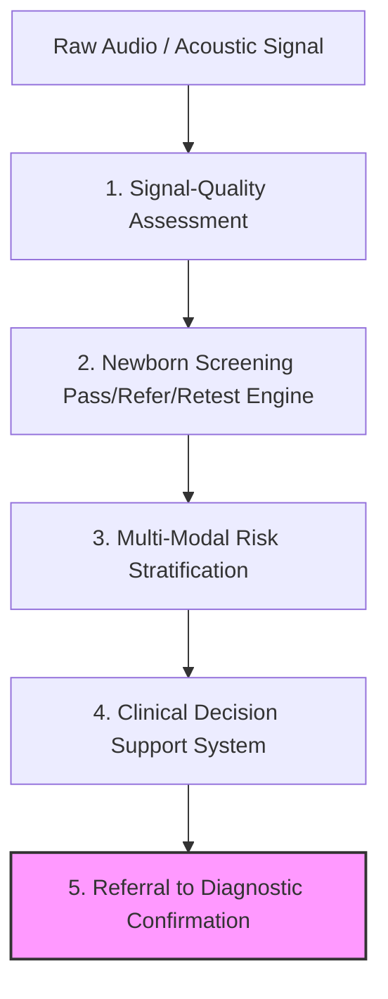
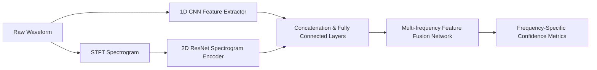
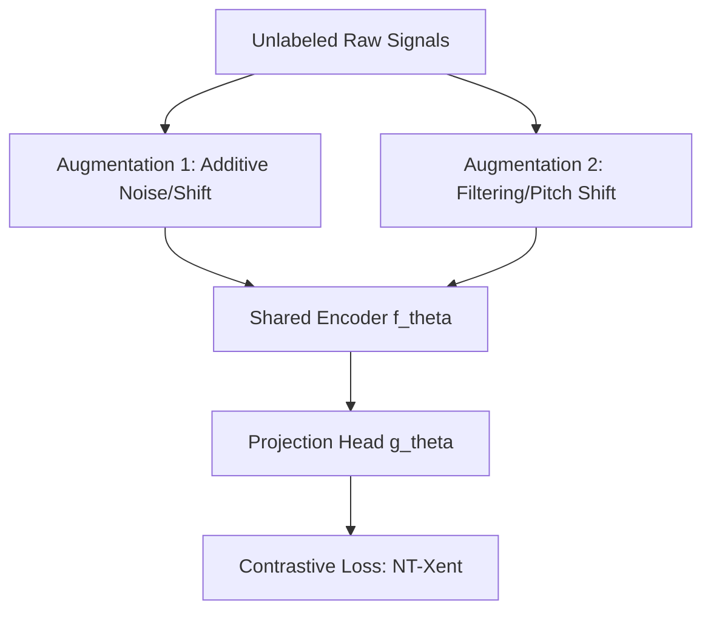
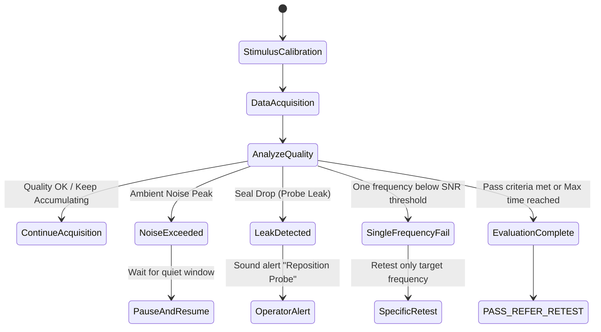
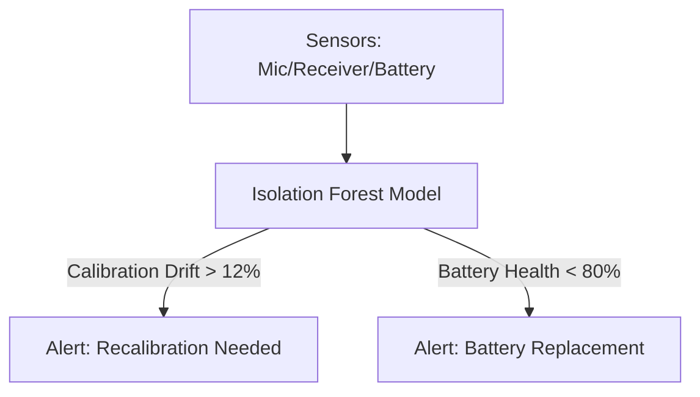
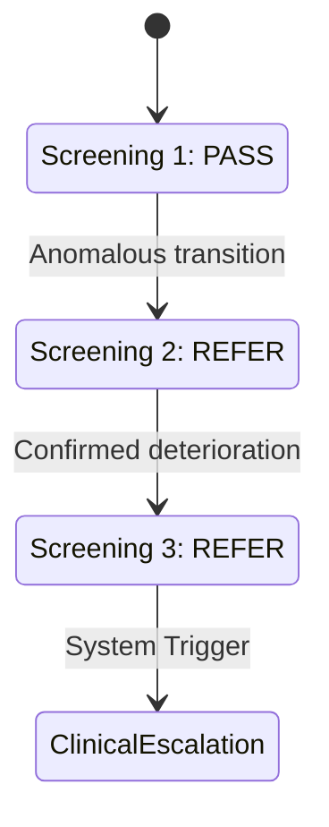
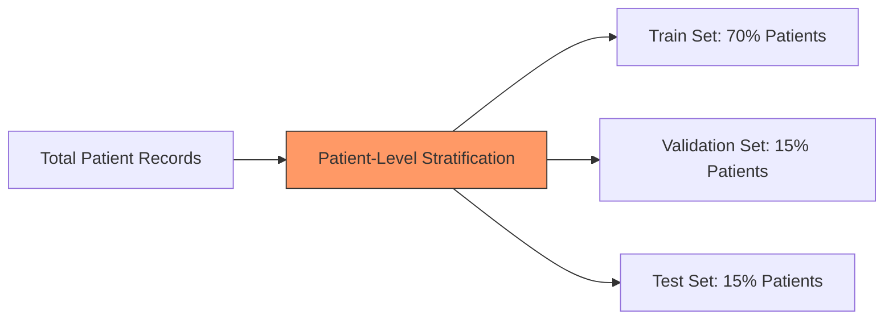
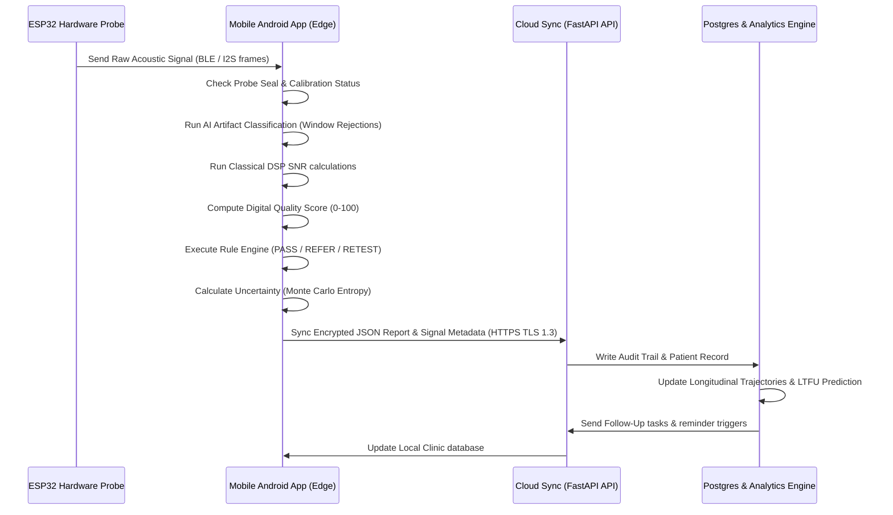

# SHRUTI Care: Advanced AI/ML-Powered MedTech Software Ecosystem Integration Document
### Product Version: v2.0-Enterprise (AI/ML-Enabled)
### Intended Deployment: Primary Health Centres (PHCs), Community Health Centers (CHCs), & Research Laboratories

---

## 1. Product Positioning & Core Philosophy

**SHRUTI Care** is positioned as:
> "An AI-assisted, low-cost, offline-capable hearing-screening and follow-up ecosystem that combines advanced acoustic signal processing, machine learning, deep learning, clinical decision support, and public-health analytics."

### Clinical & Diagnostic Separation (Regulatory & Liability Safe-Guards)
To comply with medical device regulations (e.g., FDA software as a medical device, SaMD; CDSCO guidelines), the system **NEVER** claims to autonomously diagnose deafness. The software strictly separates the clinical pipeline into five discrete tiers:



1. **Signal-Quality Assessment (Tier 1)**: Evaluates noise level, probe seal, and presence of artifacts. Rejects frames before processing.
2. **Screening (Tier 2)**: Uses a validated clinical rule engine (IEC 60645-6 standard) to output **PASS / REFER / RETEST** based on signal-to-noise ratio.
3. **Risk Stratification (Tier 3)**: Stratifies the patient into risk categories (Low, Moderate, High) using metadata and clinical risk factors.
4. **Clinical Decision Support (Tier 4)**: Suggests workflow schedules, immunization linkages, and rescreening intervals to clinicians and ASHA workers.
5. **Diagnostic Confirmation (Tier 5)**: Performed exclusively by certified audiologists using gold-standard diagnostic systems (Diagnostic ABR, ASSR, Diagnostic OAE) at tertiary centers.

---

## 2. Global Software Architecture

The SHRUTI Care ecosystem integrates hardware, mobile software, edge computation, and cloud-based analytical intelligence:

```mermaid
flowchart TD
    subgraph Edge Hardware (Patient Probe)
        HW[ESP32-S3 Board] -->|Microphone Signal / I2S| DSP1[Synchronous Averaging]
        HW -->|Stimulus Output / DAC| REC[Dual Receivers]
    end

    subgraph Mobile Device (Android Field App)
        DSP1 -->|Secure BLE Pairing| AND[Android Edge AI Engine]
        AND -->|Edge DL Artifact Classifier| ART[Artifact Rejection]
        AND -->|Quality Estimator| QUAL[Digital Quality Score: 0-100]
        AND -->|Deterministic Rule Engine| DEC[PASS / REFER / RETEST]
    end

    subgraph Cloud / Enterprise Server (FastAPI Backend)
        AND -->|HTTPS Sync / TLS 1.3| CLD[Cloud Sync Service]
        CLD --> LPR[Longitudinal Patient Record]
        CLD --> FUP[Follow-up Prediction Engine]
        CLD --> GIS[Geospatial GIS AI]
        CLD --> MON[Model Drift & Bias Monitor]
    end

    subgraph Analytics & Administrative Dashboards
        LPR --> CMD[Centralized Command Centre]
        GIS --> PHC[Public Health Dashboards]
        FUP --> REF[Clinician Referrals portal]
    end

    subgraph Parallel Research Frameworks
        PRN[Prenatal Acoustic Research Module]
        DTW[Digital Twin & Simulator]
        FED[Federated Learning Node]
    end
```

---

## 3. Section-by-Section Module Specifications

---

### Module 1: Advanced DPOAE Deep-Learning Engine
The deep learning pipeline acts as a parallel research path that processes raw acoustic waveforms to assist signal interpretation and predict cochlear response confidence. It does **not** bypass the clinical rule engine.



#### Neural Network Architectures (PyTorch Implementations)

```python
import torch
import torch.nn as nn
import torch.nn.functional as F

class DPOAE1DCNN(nn.Module):
    """
    1D CNN for raw acoustic waveform analysis (input size: [batch, 1, 44100])
    Examines temporal features and transient artifacts.
    """
    def __init__(self):
        super(DPOAE1DCNN, self).__init__()
        self.conv1 = nn.Conv1d(1, 16, kernel_size=64, stride=4, padding=30)
        self.bn1 = nn.BatchNorm1d(16)
        self.conv2 = nn.Conv1d(16, 32, kernel_size=32, stride=2, padding=15)
        self.bn2 = nn.BatchNorm1d(32)
        self.conv3 = nn.Conv1d(32, 64, kernel_size=16, stride=2, padding=7)
        self.bn3 = nn.BatchNorm1d(64)
        self.conv4 = nn.Conv1d(64, 128, kernel_size=8, stride=2, padding=3)
        self.bn4 = nn.BatchNorm1d(128)
        self.pool = nn.AdaptiveAvgPool1d(1)
        self.fc = nn.Linear(128, 64)

    def forward(self, x):
        x = F.relu(self.bn1(self.conv1(x)))
        x = F.relu(self.bn2(self.conv2(x)))
        x = F.relu(self.bn3(self.conv3(x)))
        x = F.relu(self.bn4(self.conv4(x)))
        x = self.pool(x).squeeze(-1)
        x = F.relu(self.fc(x))
        return x

class SpectrogramCNN2D(nn.Module):
    """
    2D CNN for processing Spectrogram features (input size: [batch, 1, 128, 87])
    Allows evaluation of time-frequency spectral components (f1, f2, 2f1-f2).
    """
    def __init__(self):
        super(SpectrogramCNN2D, self).__init__()
        self.conv1 = nn.Conv2d(1, 16, kernel_size=3, stride=1, padding=1)
        self.bn1 = nn.BatchNorm2d(16)
        self.conv2 = nn.Conv2d(16, 32, kernel_size=3, stride=2, padding=1)
        self.bn2 = nn.BatchNorm2d(32)
        self.conv3 = nn.Conv2d(32, 64, kernel_size=3, stride=2, padding=1)
        self.bn3 = nn.BatchNorm2d(64)
        self.pool = nn.AdaptiveAvgPool2d((4, 4))
        self.fc = nn.Linear(64 * 4 * 4, 128)

    def forward(self, x):
        x = F.relu(self.bn1(self.conv1(x)))
        x = F.relu(self.bn2(self.conv2(x)))
        x = F.relu(self.bn3(self.conv3(x)))
        x = self.pool(x)
        x = x.view(x.size(0), -1)
        x = F.relu(self.fc(x))
        return x

class TemporalStabilityTCN(nn.Module):
    """
    Temporal Convolutional Network (TCN) or LSTM layer to evaluate cross-frame stability
    """
    def __init__(self, input_dim=192, hidden_dim=64, num_layers=2):
        super(TemporalStabilityTCN, self).__init__()
        self.lstm = nn.LSTM(input_dim, hidden_dim, num_layers, batch_first=True, bidirectional=True)
        self.fc = nn.Linear(hidden_dim * 2, 32)

    def forward(self, x):
        # x shape: [batch, seq_len, input_dim]
        out, _ = self.lstm(x)
        out = out[:, -1, :] # Take last step
        out = F.relu(self.fc(out))
        return out
```

#### DPOAE Signal Characterization Formulas
Classical digital signal processing (DSP) computes DPOAE parameters at the target cubic distortion product frequency \(f_{dp} = 2f_1 - f_2\) where \(f_2/f_1 \approx 1.22\).
- **DP Peak Estimation (\(P_{dp}\))**: Calculated by taking the maximum power within a narrow window centered on the theoretical \(f_{dp}\):
  \[
  P_{dp} = \max_{f \in [f_{dp} - \Delta f, f_{dp} + \Delta f]} 20 \log_{10} |X(f)|
  \]
- **Noise Floor Estimation (\(N_{floor}\))**: Computed as the mean spectral power of \(M\) bin offsets adjacent to the DP peak, excluding the stimulus bins:
  \[
  N_{floor} = \frac{1}{M} \sum_{i \in \text{bins}_{noise}} 20 \log_{10} |X(f_i)|
  \]
- **Signal-to-Noise Ratio (SNR)**:
  \[
  \text{SNR} = P_{dp} - N_{floor}
  \]
- **Temporal Consistency Score (\(C_{temp}\))**: Measured across \(K\) successive frames as:
  \[
  C_{temp} = 1 - \frac{\sigma(P_{dp\_frames})}{\mu(P_{dp\_frames}) + \epsilon}
  \]

---

### Module 2: Self-Supervised Learning (SSL)
Labeling clinical newborn audio data is expensive and difficult due to environmental variation and clinical constraints. We use self-supervised learning (contrastive learning) to train on large amounts of unlabeled hospital recordings.



- **Objective Function (NT-Xent Loss)**: Given a similarity measure \(\text{sim}(\boldsymbol{u}, \boldsymbol{v}) = \frac{\boldsymbol{u}^T \boldsymbol{v}}{\|\boldsymbol{u}\| \|\boldsymbol{v}\|}\):
  \[
  \mathcal{L}_{i, j} = -\log \frac{\exp(\text{sim}(\boldsymbol{z}_i, \boldsymbol{z}_j)/\tau)}{\sum_{k=1}^{2N} \mathbb{I}_{[k \neq i]} \exp(\text{sim}(\boldsymbol{z}_i, \boldsymbol{z}_k)/\tau)}
  \]
- **Impact**: Pretraining on 10,000+ unlabeled records allows the downstream classifiers (e.g. artifact detection) to perform with high specificity even when only 100 labeled clinical datasets are available.

---

### Module 3: AI Artifact Classification
A dedicated neural network parses the raw audio stream in sliding windows (256ms, 50% overlap) to identify noise/technical anomalies.

```
Time-Window Signal -> Classifier Network -> Probabilities for:
[Baby Crying: 0.82]   [Movement: 0.05]   [Maternal Speech: 0.01] 
[Probe Leak: 0.02]    [Electrical: 0.08]  [Clipping: 0.02]
-> RESULT: REJECT Frame due to Crying
```

#### Artifact Categories & Features
- **Acoustic Artifacts**: Baby crying, movement/rumble, maternal speech, environmental noise, door/impact sounds, fan/AC noise.
- **Hardware/Technical Artifacts**: 50/60 Hz electrical interference, microphone clipping, probe leakage (seal broken), receiver distortion, unstable stimulus delivery.
- **Rejection Logic**: If the probability of any critical artifact exceeds \(0.5\), the window is flagged as **REJECTED** and omitted from the synchronous average.

---

### Module 4: Smart Retest Engine
Rather than restarting a failed screening, the adaptive retest engine identifies the failure mechanism and adjusts the testing protocol on the fly.



- **Actions**:
  1. *Excessive Noise*: Automatically pauses audio buffering, prompts the worker to wait, and resumes when ambient levels fall below 45 dB.
  2. *Poor Probe Seal*: Pauses acquisition, plays an audio instruction "Adjust probe fit", and auto-resumes when calibration values return to target levels.
  3. *Single Frequency Deficit*: Instead of repeating the entire sweep (e.g., 2kHz, 3kHz, 4kHz, 5kHz), it targets only the sub-threshold frequency (e.g., 3kHz) to minimize exposure and time.

---

### Module 5: Personalized Testing Protocols
Adapts tests based on the patient's biological profile and real-time environmental metrics:

| Scenario / Risk | Modality Adaptation | Logic |
| :--- | :--- | :--- |
| **Preterm Infant** (\(\le 37\) weeks) | Frequency sweep adjustments | Shifts the target range to compensate for ear canal compliance differences in premature infants. |
| **NICU Admission** | Extended averaging (up to 32 frames) | Collects more frames to establish high confidence, compensating for electrical interference in neonatal ICUs. |
| **High Noise Environment** | Narrow bandpass filtering & higher averaging | Tightens the bandpass window around \(2f_1 - f_2\) to filter ambient noise. |

---

### Module 6: Digital Quality Score (DQS)
Calculates a unified, transparent signal quality score (DQS) between 0 and 100 for each ear during testing:

\[
\text{DQS} = w_{seal} \cdot S_{seal} + w_{noise} \cdot S_{noise} + w_{stable} \cdot S_{stable} + w_{art} \cdot (100 - P_{artifact})
\]
*Where:*
- \(S_{seal}\): Probe seal score (0–100, linear mapping of reflection amplitude match).
- \(S_{noise}\): Ambient noise score (0–100, derived from environmental dB SPL).
- \(S_{stable}\): Stimulus level stability (0–100, variation from L1/L2 target levels).
- \(P_{artifact}\): Percentage of rejected frames.

#### UI Quality Assessment Dashboard Representation
```
+----------------------------------------------------+
|                   TEST QUALITY: 94/100             |
|                                                    |
|  [||||||||||||||||||||||||||||||||||||||||||] 94%  |
|                                                    |
|  Signal Quality: Excellent    Probe Fit: Good      |
|  Noise level: Low (32 dB)     Artifact Rate: 4%    |
|  Calibration: Valid           Status: READY        |
+----------------------------------------------------+
```

---

### Module 7: Explainable AI (XAI)
To keep the screening process transparent, the AI generates technical explanations for its signal quality scores using saliency mappings and attention vectors.

```
[Signal Quality Result]: REJECT FRAME
[Key Features Influencing Decision]:
  - Mel-Spectrogram Saliency: High energy detected in 100-300Hz band (Consistent with movement)
  - Attention Map Output: High attention weights placed on Frame 12 and 14 (Visualized in red)
  - SHAP Force Plot:
    [Base DQS (100)] --- (-20 Noise) --- (-40 Movement) ---> [Final DQS (40)]
```

*For poor-quality tests, the system outputs clear corrective instructions:*
- **Reason**: Excessive low-frequency rumble detected. **Recommendation**: Comfort infant, check for swaddling friction against the probe.
- **Reason**: High-frequency leakage. **Recommendation**: Select a larger ear tip size to establish a better seal.

---

### Module 8: Uncertainty-Aware AI
Instead of guessing when signal quality is marginal, the models evaluate their own confidence using Monte Carlo Dropout.

```python
def monte_carlo_dropout_predict(model, x, num_samples=50):
    """
    Performs Monte Carlo Dropout forward passes to estimate predictive uncertainty.
    """
    model.train() # Keep dropout active
    predictions = []
    with torch.no_grad():
        for _ in range(num_samples):
            pred = F.softmax(model(x), dim=-1)
            predictions.append(pred)
    
    predictions = torch.stack(predictions) # Shape: [num_samples, batch, classes]
    mean_prediction = torch.mean(predictions, dim=0)
    variance_prediction = torch.var(predictions, dim=0)
    entropy = -torch.sum(mean_prediction * torch.log(mean_prediction + 1e-8), dim=-1)
    
    return mean_prediction, variance_prediction, entropy
```
- **Uncertainty Classification**:
  - **High Confidence**: Entropy \(\le 0.15\). Result accepted.
  - **Moderate Confidence**: Entropy \(0.15 - 0.4\). Recommends extended averaging.
  - **Low Confidence**: Entropy \(\ge 0.4\). Forces a **RETEST** instead of guessing a PASS or REFER.

---

### Module 9: Out-of-Distribution (OOD) Detection
Identifies signals that deviate significantly from the training database (e.g. incorrect microphone connection, sound card failure, or unusual acoustic environments) using Mahalanobis distance in the latent feature space:

\[
D_M(\boldsymbol{z}) = \sqrt{(\boldsymbol{z} - \boldsymbol{\mu})^T \boldsymbol{\Sigma}^{-1} (\boldsymbol{z} - \boldsymbol{\mu})}
\]
If \(D_M(\boldsymbol{z}) > \tau_{\text{ood}}\), the system triggers:
> **"UNSEEN SIGNAL CONDITION — RETEST / CHECK HARDWARE"**
This prevents unpredictable classifier predictions from impacting clinical decisions.

---

### Module 10: Device Health AI (Predictive Maintenance)
Monitors internal sensor statistics to flag degradation before hardware failure occurs.



- **Features tracked**: Output impedance, noise-floor baseline, battery impedance, charging rate, temperature coefficients, calibration drift.
- **Output Notification**:
  > **Device Performance Alert**: Calibration drift of **12%** detected relative to baseline. Perform a cavity test or send for service.

---

### Module 11: Intelligent Automatic Calibration
Automates device calibration tracking using acoustic cavity models.

- **Constraint**: The AI cannot silently change the device's gain coefficients. Calibration adjustments must be verified through a standard cavity test (2cc coupler).
- **Cavity Validation algorithm**:
  1. Calibration chirp played into 2cc steel cavity.
  2. Measured frequency response compared to factory baseline using a correlation coefficient \(R\):
     \[
     R = \frac{\sum (X_{current} - \bar{X}_{current})(X_{base} - \bar{X}_{base})}{\sqrt{\sum (X_{current} - \bar{X}_{current})^2 \sum (X_{base} - \bar{X}_{base})^2}}
     \]
  3. If \(R < 0.95\), the device is flagged as out of calibration and screening is disabled.

---

### Module 12: Multimodal AI Risk Stratification
Combines signal measurements and clinical metadata to stratify risk and prioritize follow-ups.

```
[Signal Quality (DQS: 92)] + [gestational age (35w)] + [NICU stay (Yes)] + [Family history (Yes)]
  --> Multimodal Risk Engine (XGBoost / Random Forest)
  --> Output: [HIGH RISK PROFILE]
  --> Action: Prioritize for early diagnostic ABR check.
```

- **Constraint**: This module is used only for prioritization, scheduling, and risk stratification. It does **not** override the clinical rule engine verdict (PASS/REFER/RETEST).

---

### Module 13: Longitudinal Trajectory Analytics
Tracks a patient's screening history across multiple visits to flag inconsistent patterns.



- **Risk Trajectory Alert**:
  If a child progresses from **PASS** \(\rightarrow\) **REFER**, the system flags the transition as anomalous. It generates an alert warning of potential progressive hearing loss or chronic middle ear effusion, escalating the case directly to diagnostic evaluation.

---

### Module 14: Follow-up Prediction Engine
Calculates the risk of a patient being lost to follow-up (LTFU) using social and clinical metadata:

\[
P(\text{LTFU}) = \sigma(\beta_0 + \beta_1 \cdot \text{Distance} + \beta_2 \cdot \text{MissedVaccinations} + \beta_3 \cdot \text{PriorScreeningResult})
\]
- **Risk Tiers**:
  - **Low Risk** (\(< 0.3\)): Standard SMS reminders.
  - **Medium Risk** (\(0.3 - 0.7\)): Automated voice call + WhatsApp.
  - **High Risk** (\(> 0.7\)): Flags the case for direct outreach by the local health worker (ASHA/ANM).

---

### Module 15: Smart Multi-Channel Reminder System
An automated system that coordinates reminders across SMS, WhatsApp, and voice calls.
- **Features**:
  - Supports regional Indian languages (Hindi, Telugu, Kannada, Marathi, Tamil, etc.).
  - Schedules notifications to align with child immunization visits (e.g., 6, 10, and 14 weeks) to minimize travel costs for families.

---

### Module 16: Loss-to-Follow-Up Funnel Analytics
Provides public health administrators with a dashboard mapping patients through the clinical funnel.

```
[Screened: 1,200]
      |
      +---> [REFER: 80]
              |
              +---> [Rescreened: 60] (25% Drop-off)
                      |
                      +---> [Referral to Tertiary: 24]
                              |
                              +---> [Diagnostic Assessment: 12] (50% Drop-off)
                                      |
                                      +---> [Intervention: 8]
```

- **Metrics**: Drop-off rates, conversion percentages, and latency (average days) between screening and diagnostic verification.

---

### Module 17: Root-Cause Analytics
Evaluates operational bottlenecks across districts:
- **Core Engine**: Performs statistical association analysis between high referral drop-out rates and socioeconomic variables (e.g., transit distance, facility delays, staff workload).
- **Disclaimer**: *The system labels these results as statistical associations, not causal proofs.*

---

### Module 18: Geospatial AI & Resource Allocation
Uses geographic mapping to identify areas with high referral drop-out rates and simulate changes to resource allocation.

```
[Heatmap View] -> High density of REFER results in District Y, but low density of diagnostic centres.
[Simulation query]: "Deploy 1 additional device to District Y"
[Projected outcome]: Travel distance reduced by 14km, estimated follow-up rate improved by 18%.
```

- **Algorithm**: Uses spatial clustering (DBSCAN) to identify locations lacking adequate screening services.

---

### Module 19: Health-Facility Performance Analytics
Monitors facility performance to flag unusual patterns:
- **Metrics**: Average screening duration, invalid-test rates, and PASS/REFER ratios.
- **Anomaly Detection**: Flags facilities with unusually high REFER rates (e.g., \(> 25\%\), which typically indicates training or calibration issues rather than high disease prevalence) to suggest operational reviews.

---

### Module 20: AI-Assisted Training Mode
An interactive training module that simulates screening scenarios to test healthcare workers:

```
[Simulation Active]: Probe placement is misaligned (high reflection level).
[ASHA trainee action]: Reposition probe.
[Simulation update]: Seal restored. High environmental noise introduced (fan sound).
[ASHA trainee action]: Pauses test, turns off fan, and resumes.
[Score]: 94% (Probe: 98%, Noise Management: 90%)
```

---

### Module 21: Digital Twin & Screening Simulator
A complete physical simulator that generates realistic waveforms for testing and demonstration without a live infant.

- **Inputs**: Noise amplitude, probe leakage factor, target DP amplitude, stimulus level mismatch, artifact type (crying, electrical).
- **Output**: Generates a raw acoustic waveform, real-time FFT, and corresponding signal quality metrics for integration testing.

---

### Module 22: Edge AI vs Cloud Fallback Architecture
The system is built to operate offline in remote clinics, using a tiered architecture:

```mermaid
graph TD
    Device[Acoustic Probe] -->|Raw Audio| Edge[Android Edge AI Engine]
    Edge -->|Reject Artifacts / Signal Quality| EdgeCD[Edge Clinical Decision]
    
    subgraph Offline Operation (PHC Clinic)
        EdgeCD --> LocalDB[(SQLite Local DB)]
        LocalDB --> LocalReport[Print Local PDF Report]
    end
    
    EdgeCD -->|On Connection Sync| Cloud[FastAPI Enterprise Cloud]
    Cloud --> GlobalDB[(PostgreSQL Global DB)]
```

- **Benefits**: Near-zero latency, secure offline operation, and reduced dependence on mobile connectivity.

---

### Module 23: Privacy-Preserving Federated Learning
Enables model training across hospital nodes without sharing patient-identifiable data.

```
Hospital Node A: Train Local Weights w_A --> [Central Server]
Hospital Node B: Train Local Weights w_B --> [Aggregator: FedAvg] --> Update Global Weights w_g
Hospital Node C: Train Local Weights w_C --> [Central Server]
```

- **Federated Averaging Math (FedAvg)**:
  \[
  \boldsymbol{w}_{t+1} = \sum_{k=1}^{K} \frac{n_k}{n} \boldsymbol{w}_{t+1}^k
  \]
  Where \(n_k\) is the number of samples at hospital node \(k\), and \(\boldsymbol{w}^k\) represents the local model weights.

---

### Module 24: Model Drift Monitoring
Detects when the performance of an AI model degrades over time due to changes in hardware, demographics, or acoustic environments.

- **Metric (Population Stability Index - PSI)**:
  \[
  \text{PSI} = \sum_{i=1}^{B} \left( P_i - Q_i \right) \times \ln\left(\frac{P_i}{Q_i}\right)
  \]
  Where \(P_i\) is the validation distribution and \(Q_i\) is the production distribution. If \(\text{PSI} \ge 0.2\), the system alerts administrators of model drift.
- **Safety Policy**: *Models are never silently updated. Any updates require expert clinical review and validation.*

---

### Module 25: Bias and Fairness Monitoring
Monitors the performance of the system across demographics to prevent diagnostic bias:

- **Metrics tracked**: Equalized Odds, Demographic Parity, and False Negative Rate disparities.
- **Trigger**: If the False Negative Rate is significantly higher for a specific group (e.g., based on gender or geographic region) than the overall baseline, the system flags the bias for administrative review.

---

### Module 26: Pre-Birth / Prenatal Research AI
An experimental, research-only module that evaluates fetal risk using maternal-abdominal sensors.

- **Inputs**: Abdominal acoustic signals, contact microphone recordings, fetal movement indices, and maternal risk factors.
- **Safety Warnings**:
  > [!WARNING]
  > This module is explicitly labeled as experimental and research-oriented. It does not provide clinical diagnoses. Routine clinical use requires formal clinical trial validation and regulatory approval.

---

### Module 27: Ultrasound Computer Vision
An experimental module designed to assist clinicians by extracting developmental indicators from fetal ultrasound scans.

```python
class UltrasoundSegmentationUNet(nn.Module):
    """
    U-Net Architecture for Segmenting Fetal Anatomical Features (e.g., Head Circumference)
    """
    def __init__(self, in_channels=1, out_channels=1):
        super(UltrasoundSegmentationUNet, self).__init__()
        self.enc1 = self.conv_block(in_channels, 64)
        self.enc2 = self.conv_block(64, 128)
        self.enc3 = self.conv_block(128, 256)
        self.pool = nn.MaxPool2d(kernel_size=2, stride=2)
        
        self.bottleneck = self.conv_block(256, 512)
        
        self.up3 = nn.ConvTranspose2d(512, 256, kernel_size=2, stride=2)
        self.dec3 = self.conv_block(512, 256)
        self.up2 = nn.ConvTranspose2d(256, 128, kernel_size=2, stride=2)
        self.dec2 = self.conv_block(256, 128)
        self.up1 = nn.ConvTranspose2d(128, 64, kernel_size=2, stride=2)
        self.dec1 = self.conv_block(128, 64)
        
        self.final = nn.Conv2d(64, out_channels, kernel_size=1)

    def conv_block(self, in_c, out_c):
        return nn.Sequential(
            nn.Conv2d(in_c, out_c, kernel_size=3, padding=1),
            nn.BatchNorm2d(out_c),
            nn.ReLU(inplace=True),
            nn.Conv2d(out_c, out_c, kernel_size=3, padding=1),
            nn.BatchNorm2d(out_c),
            nn.ReLU(inplace=True)
        )

    def forward(self, x):
        e1 = self.enc1(x)
        e2 = self.enc2(self.pool(e1))
        e3 = self.enc3(self.pool(e2))
        
        b = self.bottleneck(self.pool(e3))
        
        d3 = self.dec3(torch.cat([self.up3(b), e3], dim=1))
        d2 = self.dec2(torch.cat([self.up2(d3), e2], dim=1))
        d1 = self.dec1(torch.cat([self.up1(d2), e1], dim=1))
        return self.final(d1)
```

---

### Module 28: Generative AI Health Assistant
An offline-capable health assistant that answers operational and protocol-related questions:
- **Authorized Knowledge Base**: The assistant's context is restricted to approved clinical manuals, FAQs, and hardware troubleshooting guides.
- **Safety Rule**: If a user asks diagnostic or medical questions outside this context, the assistant outputs a fallback message:
  > "I can only answer questions about the operation of the device and the screening protocol. Please consult an audiologist for diagnostic and medical questions."

---

### Module 29: Voice AI Guidance
Provides voice-guided troubleshooting to health workers during testing:
- **Speech-to-Text (STT)**: Allows hands-free operation via voice commands (e.g., "Start left ear", "Calibrate probe").
- **Text-to-Speech (TTS)**: Translates real-time alerts into regional languages:
  > *"Probe position is slipping. Adjust probe fit."*

---

### Module 30: Multilingual Parent Education AI
Generates easy-to-understand explanations of screening results for parents:
- **Result Interpretation**: Translates results into local languages, explaining that a **REFER** result indicates the need for a follow-up test and is not a diagnosis of deafness.
- **Languages supported**: Hindi, Telugu, Tamil, Marathi, Bengali, Kannada, and English.

---

### Module 31: Automated Clinical Report Generation
Generates a structured, clinical report in PDF/JSON format:

#### Patient Screening Report Structure
```json
{
  "report_metadata": {
    "report_id": "REP-SHRUTI-20260823-0004",
    "timestamp": "2026-08-23T00:30:00Z",
    "facility": "Primary Health Centre, Noida",
    "operator_id": "ASHA-worker-N08"
  },
  "patient_demographics": {
    "baby_id": "infant-8812",
    "name": "Arjun Kumar",
    "age_days": 3,
    "gestational_age_weeks": 39,
    "nicu_admission": false
  },
  "device_telemetry": {
    "device_serial": "SHR-ESP32-S3-0021",
    "firmware_version": "v1.2.3",
    "calibration_valid": true,
    "last_self_test_status": "PASS"
  },
  "clinical_screening_results": {
    "protocol": "DPOAE Screening (IEC 60645-6)",
    "ear_tested": "Both",
    "measurements": {
      "left_ear": {
        "frequencies": [2000, 3000, 4000, 5000],
        "dp_amplitudes": [-10.2, -8.4, -9.1, -11.5],
        "noise_floors": [-38.2, -41.2, -39.1, -40.5],
        "snrs": [28.0, 32.8, 30.0, 29.0],
        "verdict": "PASS"
      },
      "right_ear": {
        "frequencies": [2000, 3000, 4000, 5000],
        "dp_amplitudes": [-11.0, -12.1, -26.0, -28.0],
        "noise_floors": [-39.1, -38.5, -31.2, -30.1],
        "snrs": [28.1, 26.4, 5.2, 2.1],
        "verdict": "REFER"
      }
    },
    "verdict": "REFER",
    "follow_up_recommendation": "Referral to tertiary audiology center for diagnostic ABR within 7 days."
  },
  "quality_and_validation": {
    "digital_quality_score": 92.5,
    "probe_fit_rating": "Good",
    "average_ambient_noise_db": 34.2,
    "artifact_rate": 3.8,
    "ai_confidence_score": 0.94
  },
  "disclaimer": "This report represents a screening test. Screening results do not confirm or rule out all hearing disorders. An audiological evaluation (ABR) is required for definitive diagnostic confirmation."
}
```

---

### Module 32: Research and Data Science Dashboard
A dashboard designed to help clinical researchers evaluate and refine system algorithms:
- **Metrics**: Displays ROC and Precision-Recall curves, confusion matrices, Sensitivity, Specificity, Positive Predictive Value (PPV), Negative Predictive Value (NPV), and F1-Scores.
- **Model Comparison Engine**: Allows researchers to compare different diagnostic backends (DSP-Only vs. ML Classifiers vs. Deep Learning vs. Hybrid models).

---

### Module 33: Model Validation Pipeline
Ensures model updates are validated without data leakage:



- **Policy**: *Data splitting is strictly patient-stratified. Multiple measurements from the same patient cannot be split across training and validation sets, preventing data leakage.*

---

### Module 34: Digital Audit Trail
A secure, write-only audit trail schema (implemented in SQLite/PostgreSQL) that records all changes to screening protocols:

```sql
CREATE TABLE clinical_audit_trail (
    audit_id INTEGER PRIMARY KEY AUTOINCREMENT,
    timestamp TEXT DEFAULT CURRENT_TIMESTAMP,
    operator_id TEXT NOT NULL,
    device_serial TEXT NOT NULL,
    software_version TEXT NOT NULL,
    patient_uuid TEXT NOT NULL,
    test_result_verdict TEXT CHECK(test_result_verdict IN ('PASS', 'REFER', 'RETEST')),
    calibration_signature TEXT NOT NULL,
    raw_signal_hash TEXT NOT NULL,
    override_occurred INTEGER CHECK(override_occurred IN (0, 1)),
    override_reason TEXT,
    system_log_hash TEXT
);
```

---

### Module 35: Cybersecurity and Compliance Framework
A multi-layered cybersecurity framework designed to secure patient and telemetry data.

- **Device Pairing**: Uses secure Bluetooth Low Energy (BLE) pairing with Out-of-Band (OOB) keys or numeric comparison to prevent man-in-the-middle attacks.
- **Data Encryption**: Patient records are encrypted at rest on mobile devices and edge hardware using AES-256-GCM.
- **Data Transfer**: Transmitted via HTTPS with TLS 1.3.
- **Data Privacy**: Patient data is anonymized prior to cloud synchronization. Identifying features (e.g., patient name, phone number) are replaced with a cryptographic hash (HMAC-SHA256).

---

### Module 36: Advanced Multi-Domain Analytics Dashboards
A centralized analytics suite that monitors five core operational domains:

1. **Operational Analytics**: Tracks device uptime, screening durations, and operator throughput.
2. **Clinical Analytics**: Monitors regional REFER rate trends to detect potential localized health issues or screening errors.
3. **AI Analytics**: Monitors prediction confidence metrics and model drift indicators.
4. **Public Health Analytics**: Tracks referral follow-up completion rates, district coverage, and resource gaps.
5. **Financial Analytics**: Estimates cost-effectiveness based on screening throughput and avoided follow-up visits.

---

### Module 37: Cost-Effectiveness Simulator
A simulation tool that projects long-term cost benefits for healthcare decision-makers:

- **Cost Equation**:
  \[
  \text{Cost}_{total} = N_{infants} \times C_{screen} + P_{refer} \times N_{infants} \times C_{diagnostic} + P_{ltfu} \times N_{infants} \times C_{societal}
  \]
  *Where:*
  - \(C_{screen}\): Screening cost per infant (incorporating low-cost hardware amortizations).
  - \(C_{diagnostic}\): Cost of tertiary diagnostic follow-up.
  - \(C_{societal}\): Long-term societal costs associated with late-detected hearing loss.
- **Simulation**: Allows users to adjust variables (such as device distribution or referral efficiency) to project regional healthcare savings.

---

### Module 38: Centralized Command Centre
A centralized, real-time dashboard that monitors the device fleet and operational health:

```
========================================================================
                      SHRUTI CARE COMMAND CENTRE                        
========================================================================
 Devices Online: 142/150      Active Screenings: 24      Errors: 0      
 ---------------------------------------------------------------------- 
 Today's Totals:                                                        
   [PASS: 812]           [REFER: 48 (5.6%)]       [RETEST: 32 (3.7%)]   
                                                                        
 High-Risk Operational Alerts:                                          
   * DEVICE SHR-045: Calibration Drift (12.4%) -- Cavity Test Required! 
   * PHC BENGALURU: Elevated RETEST rate (18.2%) -- Check Room Noise!   
   * REFERRAL TIMEOUT: 14 referrals overdue for diagnostic check in Dist X.
========================================================================
```

---

### Module 39: Final System Architecture Flow
Trace of data processing paths, from raw input signal capture to cloud-based predictive follow-ups:



---

## 4. Final Product Positioning

The final product is positioned as a comprehensive solution built to improve screening efficiency and patient outcomes:

```
        +-------------------------------------------------+
        |                    ACCESS                       |
        |  Low-cost hardware probe deployable in PHCs     |
        +-----------------------+-------------------------+
                                |
                                v
        +-----------------------+-------------------------+
        |                    SCREEN                       |
        |  Acoustic DPOAE screening at patient bedside    |
        +-----------------------+-------------------------+
                                |
                                v
        +-----------------------+-------------------------+
        |                   VALIDATE                      |
        |  Digital Quality Score & real-time calibration  |
        +-----------------------+-------------------------+
                                |
                                v
        +-----------------------+-------------------------+
        |                   ANALYZE                       |
        |  Edge AI checks & clinical decision rules       |
        +-----------------------+-------------------------+
                                |
                                v
        +-----------------------+-------------------------+
        |                    REFER                      |
        |  Automated digital referrals to specialists     |
        +-----------------------+-------------------------+
                                |
                                v
        +-----------------------+-------------------------+
        |                  FOLLOW UP                      |
        |  Multilingual reminders & tracking              |
        +-----------------------+-------------------------+
                                |
                                v
        +-----------------------+-------------------------+
        |                    LEARN                        |
        |  Federated learning & drift tracking            |
        +-----------------------+-------------------------+
                                |
                                v
        +-----------------------+-------------------------+
        |                   IMPROVE                       |
        |  Resource allocation & performance analytics   |
        +-------------------------------------------------+
```

SHRUTI Care is designed to run offline in rural primary health centers, while providing clinicians, audiologists, and health administrators with the tools needed to track and manage infant hearing health.
